# 🚫Team Nulls

* * *

## 목차
- [🚫Team Nulls](#team-nulls)
  - [목차](#목차)
  - [1.👥 팀원 소개](#1-팀원-소개)
  - [2. 🛹프로젝트 개요](#2-프로젝트-개요)
    - [2.1. 🎈프로젝트 소개](#21-프로젝트-소개)
    - [2.2. ❕프로젝트 필요성](#22-프로젝트-필요성)
    - [2.3 🤲프로젝트 예상 사용자](#23-프로젝트-예상-사용자)
    - [2.4 🏐프로젝트 목표](#24-프로젝트-목표)
    - [2.5 🏀프로젝트 시나리오](#25-프로젝트-시나리오)
  - [3. 🚙기술스택](#3-기술스택)
  - [4. 🐻요구사항 명세서](#4-요구사항-명세서)
  - [5. 🐧테이블 명세서](#5-테이블-명세서)
  - [6. 🐣ERD](#6-erd)
  - [7. 🎃SQL](#7-sql)
    - [7.1 📍DDL](#71-ddl)
    - [7.2 🎈DML](#72-dml)
    - [7.3 🏐Test Case](#73-test-case)
  - [8. 🎉후기.](#8-후기)
        - [민정기](#민정기)
        - [김예지](#김예지)
        - [김정수](#김정수)
        - [방지혁](#방지혁)
        - [이슬이](#이슬이)
        - [현재진](#현재진)
 

## 1.👥 팀원 소개
| 민정기 (팀장, 챗봇) | 김예지 (대출) | 김정수(유저,관리자) | 방지혁(주식 거래) | 이슬이(유저,관리자) | 현재진(게시물) |
| --- | --- | --- | --- | --- | --- |
|||||||

* * *

## 2. 🛹프로젝트 개요
* * *
### 2.1. 🎈프로젝트 소개
2030 세대를 중심으로 개인 투자자가 빠르게 증가하면서[[1]](https://www.hankyung.com/article/2025111668521), 유튜브·커뮤니티·SNS 기반의 정보 소비가 주식 거래에 직접적인 영향을 미치고 있다.[[2]](https://www.jibs.co.kr/news/articles/articlesDetail/39630?feed=da&kakao_from=mainnews)[[3] ](https://www.kcmi.re.kr/report/report_view?report_no=1235)그러나 이러한 정보는 신뢰도와 맥락 등 확실한 정보라고 파악하기 힘들어서 개인 투자자들은 이러한 정보를 보고 제대로된 판단을 내리기 힘들고 이로 인해 충동적인 매매로 이어질수가 있다.
* * *
### 2.2. ❕프로젝트 필요성
본 서비스는 단순한 주식 거래 기능을 제공하는 것을 넘어, 투자자의 거래 이력과 행동을 기반으로 한 정보 제공, 사용자 간 의견 교환 및 정보 교환이 가능한 커뮤니티, AI 챗봇을 통한 투자 정보 요약 및 의사 결정 보조 그리고 투자 여력을 고려한 대출, 자금 관리 기능을 통합한 개인 투자자 중심의 주식 거래 플랫폼을 목표로 한다. 이를 통해 사용자는 단순한 매매가 아닌 이해 기반의 투자 경험을 할 수 있도록 한다.
* * *
### 2.3 🤲프로젝트 예상 사용자
- 사용자 A, 20대 후반, 직장인: 주변에서 다들 재테크로 인해 주식투자를 하기 시작하면서, 자신도 뒤쳐질 생각이 두려워 주식투자를 하기 시작한다. 주식투자가 이번이 처음이고 어떻게 해야할지 모르는 상황이라 불안하기만 하다. 하지만 이 서비스를 사용하여, 다른사람들의 매수 현황 매도 현황을 보고 의견을 들으며 견해를 늘리며 주식을 매수 또는 매도 할 자신이 생긴다.
- 사용자 B, 30대 중반, 주부: 우연히 유튜브 알고리즘에 주식에 대한 영상이 나타나면서, 주식에 대한 정보를 얻게 된다. 하지만 B씨는 유튜브 영상의 정보가 제대로 된 정보인지 확실치 않았다. 하지만 어플 내의 챗봇을 통하여 정보에 대한 출처를 명확히 알게 되었고 어떠한 정보를 확신해야 하는지를 알게 됨으로써, 주식에 대해 매수 매도에 대한 자신의 행동에 자신감을 가지게 된다.
* * *
### 2.4 🏐프로젝트 목표
본 서비스의 목표는 주식 거래를 하며 주식 거래시 검증되지 않은 뉴스와 정보로 인한 잘못된 의사결정을 방지하는 것입니다.
사용자는 다양한 투자자들과의 의견 교류를 통해 정보의 신뢰성을 검증할 수 있으며, AI 챗봇을 활용해 뉴스 요약, 사실 확인, 종목 관련 정보를 제공받아 보다 합리적인 판단을 기반으로 주식 거래를 수행할 수 있도록 돕습니다.
* * *

### 2.5 🏀프로젝트 시나리오
[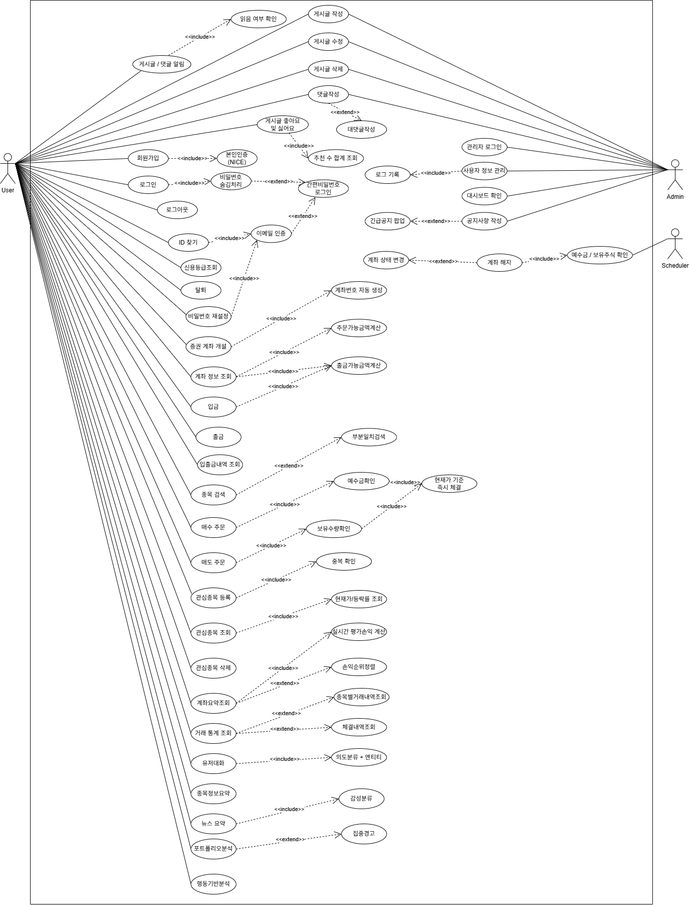](https://drive.google.com/file/d/1IZ-oC9UUSV5uRwYueSXk2hN4eeeuUTG0/view)

* * *

## 3. 🚙기술스택


* * *
## 4. 🐻요구사항 명세서
 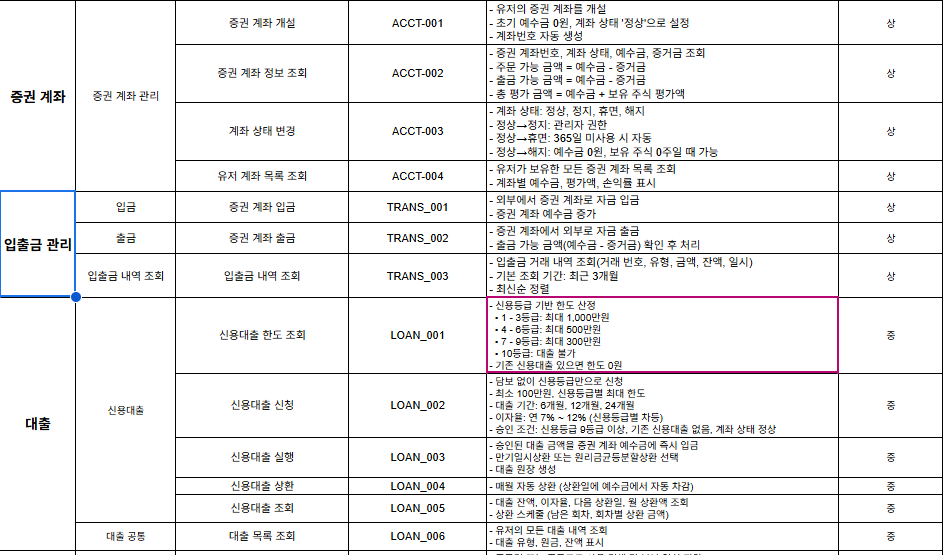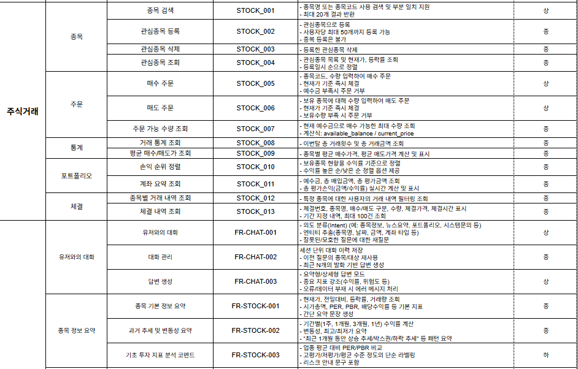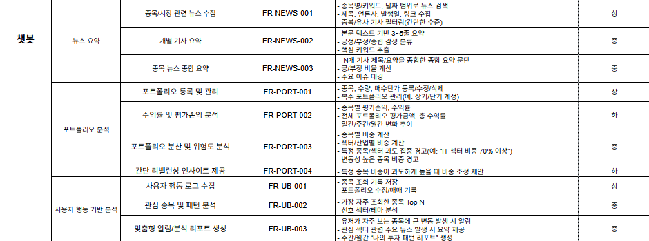
* * *
## 5. 🐧테이블 명세서


* * *

## 6. 🐣ERD

[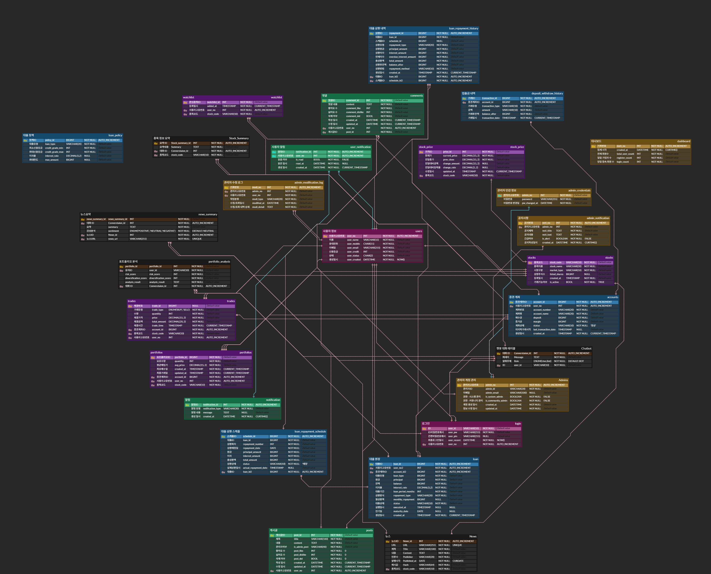](https://www.erdcloud.com/d/85rc3G9JSsJkdZcZD)

* * *

## 7. 🎃SQL
* * *
### 7.1 📍DDL

<details>
<summary>User</summary>
<div markdown="1">

```
CREATE TABLE `users` (
  `user_no` INT AUTO_INCREMENT NOT NULL COMMENT '사용자고유번호',
  `user_name` VARCHAR(15) NOT NULL COMMENT '이름',
  `user_mobile` CHAR(11) NOT NULL COMMENT '휴대전화',
  `user_email` VARCHAR(255) NOT NULL COMMENT '이메일',
  `user_credit` INT NOT NULL COMMENT '신용등급',
  `user_status` CHAR(2) NOT NULL COMMENT '상태',
  `user_created` DATETIME NOT NULL DEFAULT NOW() COMMENT '가입일시',

  CONSTRAINT PRIMARY KEY (user_no),
  CONSTRAINT uq_user_mobile UNIQUE (user_mobile),
  CONSTRAINT uq_user_email UNIQUE (user_email),
  CONSTRAINT chk_user_credit CHECK (`user_credit` BETWEEN 0 AND 10),
  CONSTRAINT chk_user_status CHECK (`user_status` IN ('정상', '탈퇴'))
);
```

</div>
</details>

<details>
<summary>Admin</summary>
<div markdown="1">

```
CREATE TABLE admins (
    admin_no INT NOT NULL AUTO_INCREMENT,
    admin_id VARCHAR(20) NOT NULL UNIQUE,
    admin_email VARCHAR(100) NOT NULL UNIQUE,
    is_system_admin BOOL NOT NULL DEFAULT FALSE,
    is_community_admin BOOL NOT NULL DEFAULT FALSE,
    created_at DATETIME NOT NULL DEFAULT NOW(),
    updated_at DATETIME,

    PRIMARY KEY (admin_no)
);
```

</div>
</details>

<details>
<summary>Stock</summary>
<div markdown="1">

```
CREATE TABLE stocks (
    stock_code VARCHAR(10) PRIMARY KEY COMMENT '종목 코드',
    stock_name VARCHAR(30) NOT NULL COMMENT '종목 이름',
    market_type VARCHAR(10) NOT NULL COMMENT '시장 구분',
    listed_shares BIGINT COMMENT '상장 주식수',
    created_at TIMESTAMP NOT NULL COMMENT '등록일시',
    is_active BOOL NOT NULL DEFAULT TRUE COMMENT '거래 가능 여부'
) COMMENT='주식 종목';
```

</div>
</details>

<details>
<summary>Account</summary>
<div markdown="1">

```
CREATE TABLE accounts (
    account_id BIGINT NOT NULL AUTO_INCREMENT PRIMARY KEY,
    user_no INT NOT NULL REFERENCES users(user_no),
    account_number VARCHAR(20) NOT NULL,
    account_name VARCHAR(20) NOT NULL,
    deposit BIGINT NOT NULL DEFAULT 0,
    margin BIGINT NOT NULL DEFAULT 0,
    `status` VARCHAR(10) NOT NULL DEFAULT '정상',
    last_transaction_at TIMESTAMP NULL,
    created_at TIMESTAMP NOT NULL DEFAULT CURRENT_TIMESTAMP,

    CONSTRAINT chk_accounts_deposit CHECK (deposit >= 0),
    CONSTRAINT chk_accounts_margin CHECK (margin >= 0),
    CONSTRAINT chk_accounts_status CHECK (status IN ('정상', '정지', '휴면', '해지'))
);
```

</div>
</details>

<details>
<summary>Dashboard</summary>
<div markdown="1">

```
CREATE TABLE dashboard (
    dash_no INT NOT NULL AUTO_INCREMENT,
    created_at DATETIME NOT NULL DEFAULT NOW(),
    total_user_count INT NOT NULL CHECK (total_user_count >= 0),
    register_count INT NOT NULL CHECK (register_count >= 0),
    login_count INT NOT NULL CHECK (login_count >= 0),

    PRIMARY KEY (dash_no)
);
```

</div>
</details>

<details>
<summary>Chat Bot</summary>
<div markdown="1">

```
CREATE TABLE `Chatbot` (
    `conversation_id` INT NOT NULL AUTO_INCREMENT COMMENT '대화 ID',
    `user_id` VARCHAR(10) NOT NULL COMMENT '사용자',
    `message` TEXT NOT NULL COMMENT '메시지',
    `role` ENUM('USER', 'BOT') NOT NULL DEFAULT 'BOT' COMMENT '발화주체',

    CONSTRAINT PRIMARY KEY (`conversation_id`),
    CONSTRAINT `fk_chatbot_user` FOREIGN KEY (`user_id`) REFERENCES `login`(`user_id`) 
) COMMENT='챗봇 대화 테이블';
```

</div>
</details>

<details>
<summary>Loan Policy</summary>
<div markdown="1">

```
CREATE TABLE loan_policy (
    policy_id BIGINT NOT NULL AUTO_INCREMENT PRIMARY KEY,
    loan_type VARCHAR(20) NOT NULL,
    credit_grade_min INT NOT NULL,
    credit_grade_max INT NOT NULL,
    interest_rate DECIMAL(5,2) NULL,
    max_amount BIGINT NULL,

    CONSTRAINT chk_policy_loan_type CHECK (loan_type IN ('신용')),
    CONSTRAINT chk_policy_credit_min CHECK (credit_grade_min BETWEEN 1 AND 10),
    CONSTRAINT chk_policy_credit_max CHECK (credit_grade_max BETWEEN 1 AND 10),
    CONSTRAINT chk_policy_credit_range CHECK (credit_grade_min <= credit_grade_max),
    CONSTRAINT chk_policy_interest_rate CHECK (interest_rate BETWEEN 0 AND 20.00),
    CONSTRAINT chk_policy_max_amount CHECK (max_amount IS NULL OR max_amount > 0)
);
```

</div>
</details>

<details>
<summary>Login</summary>
<div markdown="1">

```
CREATE TABLE `login` (
	`user_id`           VARCHAR(10) NOT NULL				   COMMENT 'ID',
	`user_no`           INT NOT NULL							   COMMENT '사용자고유번호',
	`user_pw`           VARCHAR(255) NOT NULL				   COMMENT 'ID비밀번호해시',
	`user_pin`          VARCHAR(255) NULL					   COMMENT '간편비밀번호해시',
	`user_recent`       DATETIME NOT NULL DEFAULT NOW()   COMMENT '최종로그인일시',

	CONSTRAINT PRIMARY KEY (user_id),
	CONSTRAINT fk_login_user_no FOREIGN KEY (user_no) REFERENCES `users`(`user_no`)
);
```

</div>
</details>

<details>
<summary>Accounts</summary>
<div markdown="1">

```
CREATE TABLE accounts (
    account_id BIGINT NOT NULL AUTO_INCREMENT PRIMARY KEY,
    user_no INT NOT NULL REFERENCES users(user_no),
    account_number VARCHAR(20) NOT NULL,
    account_name VARCHAR(20) NOT NULL,
    deposit BIGINT NOT NULL DEFAULT 0,
    margin BIGINT NOT NULL DEFAULT 0,
    `status` VARCHAR(10) NOT NULL DEFAULT '정상',
    last_transaction_at TIMESTAMP NULL,
    created_at TIMESTAMP NOT NULL DEFAULT CURRENT_TIMESTAMP,

    CONSTRAINT chk_accounts_deposit CHECK (deposit >= 0),
    CONSTRAINT chk_accounts_margin CHECK (margin >= 0),
    CONSTRAINT chk_accounts_status CHECK (status IN ('정상', '정지', '휴면', '해지'))
);

```

</div>
</details>

<details>
<summary>Accounts</summary>
<div markdown="1">

```
CREATE TABLE accounts (
    account_id BIGINT NOT NULL AUTO_INCREMENT PRIMARY KEY,
    user_no INT NOT NULL REFERENCES users(user_no),
    account_number VARCHAR(20) NOT NULL,
    account_name VARCHAR(20) NOT NULL,
    deposit BIGINT NOT NULL DEFAULT 0,
    margin BIGINT NOT NULL DEFAULT 0,
    `status` VARCHAR(10) NOT NULL DEFAULT '정상',
    last_transaction_at TIMESTAMP NULL,
    created_at TIMESTAMP NOT NULL DEFAULT CURRENT_TIMESTAMP,

    CONSTRAINT chk_accounts_deposit CHECK (deposit >= 0),
    CONSTRAINT chk_accounts_margin CHECK (margin >= 0),
    CONSTRAINT chk_accounts_status CHECK (status IN ('정상', '정지', '휴면', '해지'))
);

```

</div>
</details>

<details>
<summary>Posts</summary>
<div markdown="1">

```
CREATE TABLE posts (
    post_id INT NOT NULL AUTO_INCREMENT,
    user_no INT NOT NULL,
    title VARCHAR(100) NOT NULL,
    content TEXT NOT NULL,
    is_admin_post VARCHAR(40) NOT NULL CHECK (is_admin_post IN ('admin', 'user')),
    post_like INT NOT NULL DEFAULT 0 CHECK (post_like >= 0),
    post_dislike INT NOT NULL DEFAULT 0 CHECK (post_dislike >= 0),
    post_del BOOLEAN NOT NULL DEFAULT FALSE,
    created_at DATETIME NOT NULL DEFAULT CURRENT_TIMESTAMP,
    updated_at DATETIME NOT NULL DEFAULT CURRENT_TIMESTAMP ON UPDATE CURRENT_TIMESTAMP,

    PRIMARY KEY (post_id),
    CONSTRAINT fk_posts_user
        FOREIGN KEY (user_no) REFERENCES users(user_no)
);

```

</div>
</details>

<details>
<summary>Notification</summary>
<div markdown="1">

```
CREATE TABLE notification (
    notification_id INT NOT NULL AUTO_INCREMENT,
    notification_type VARCHAR(30) NOT NULL CHECK (notification_type IN ('POST', 'COMMENT')),
    message TEXT NULL,
    created_at DATETIME NOT NULL DEFAULT CURRENT_TIMESTAMP,

    PRIMARY KEY (notification_id)
);

```

</div>
</details>

<details>
<summary>News</summary>
<div markdown="1">

```
CREATE TABLE `News` (
    `News_id` INT NOT NULL AUTO_INCREMENT COMMENT '뉴스 ID',
    `Title` VARCHAR(100) NOT NULL COMMENT '제목',
    `Content` TEXT NOT NULL COMMENT '내용',
    `Publisher` VARCHAR(20) NOT NULL COMMENT '언론사',
    `URL` VARCHAR(255) NOT NULL COMMENT 'URL',
    `Published_at` DATE NOT NULL DEFAULT (CURRENT_DATE) COMMENT '발행날짜',
    `Hash` VARCHAR(64) NOT NULL COMMENT '해시값 (중복방지)',
    `stock_code` VARCHAR(10) NOT NULL COMMENT '주식코드',

    CONSTRAINT PRIMARY KEY (`News_id`),
    CONSTRAINT `uq_news_url` UNIQUE (`URL`),
    CONSTRAINT `fk_news_stock` FOREIGN KEY (`stock_code`) REFERENCES `stocks`(`stock_code`)
) COMMENT='뉴스';

```

</div>
</details>

<details>
<summary>Stock Price</summary>
<div markdown="1">

```
CREATE TABLE stock_price (
    price_id INT PRIMARY KEY AUTO_INCREMENT COMMENT '가격 ID',
    stock_code VARCHAR(10) NOT NULL COMMENT '종목 코드',
    current_price DECIMAL(15,2) NOT NULL COMMENT '현재가',
    prev_close DECIMAL(15,2) NOT NULL COMMENT '전일 종가',
    change_amount DECIMAL(15,2) COMMENT '전일대비 금액',
    change_rate DECIMAL(5,2) COMMENT '전일대비 등락률',
    updated_at TIMESTAMP NOT NULL DEFAULT CURRENT_TIMESTAMP COMMENT '수정일시',
        
    FOREIGN KEY (stock_code) REFERENCES stocks(stock_code),
    CHECK (current_price > 0),
    CHECK (prev_close > 0)
) COMMENT='주식 종목 가격';

```

</div>
</details>

<details>
<summary>Loan</summary>
<div markdown="1">

```
CREATE TABLE loan (
    loan_id BIGINT NOT NULL AUTO_INCREMENT PRIMARY KEY,
    user_no INT NOT NULL REFERENCES users(user_no),
    account_id BIGINT NOT NULL REFERENCES accounts(account_id),
    loan_type VARCHAR(20) NOT NULL,
    principal BIGINT NOT NULL,
    balance BIGINT NOT NULL,
    interest_rate DECIMAL(5,2) NOT NULL,
    loan_period_months INT NOT NULL,
    repayment_type VARCHAR(20) NOT NULL,
    monthly_repayment BIGINT NULL,
    `status` VARCHAR(10) NOT NULL DEFAULT '승인',
    executed_at TIMESTAMP NULL DEFAULT NULL,
    maturity_date DATE NULL DEFAULT NULL,
    created_at TIMESTAMP NOT NULL DEFAULT CURRENT_TIMESTAMP,

    CONSTRAINT chk_loan_type CHECK (loan_type IN ('신용')),
    CONSTRAINT chk_loan_principal CHECK (principal > 0),
    CONSTRAINT chk_loan_balance CHECK (balance >= 0 AND balance <= principal),
    CONSTRAINT chk_loan_interest_rate CHECK (interest_rate BETWEEN 0 AND 20.00),
    CONSTRAINT chk_loan_period CHECK (loan_period_months > 0),
    CONSTRAINT chk_loan_repayment_type CHECK (repayment_type IN ('만기일시상환', '원리금균등분할')),
    CONSTRAINT chk_loan_monthly_repayment CHECK (monthly_repayment IS NULL OR monthly_repayment >= 0),
    CONSTRAINT chk_loan_status CHECK (status IN ('승인', '실행중', '완료', '연체'))
);

```

</div>
</details>

<details>
<summary>Loan Repayment Schedule</summary>
<div markdown="1">

```
CREATE TABLE loan_repayment_schedule (
    schedule_id BIGINT NOT NULL AUTO_INCREMENT PRIMARY KEY,
    loan_id BIGINT NOT NULL REFERENCES loan(loan_id),
    repayment_number INT NOT NULL,
    repayment_date DATE NOT NULL,
    principal_amount BIGINT NOT NULL,
    interest_amount BIGINT NOT NULL,
    total_amount BIGINT NOT NULL,
    `status` VARCHAR(10) NOT NULL DEFAULT '예정',
    actual_repayment_at TIMESTAMP NULL,
    
    CONSTRAINT chk_schedule_repayment_number CHECK (repayment_number > 0),
    CONSTRAINT chk_schedule_principal CHECK (principal_amount >= 0),
    CONSTRAINT chk_schedule_interest CHECK (interest_amount >= 0),
    CONSTRAINT chk_schedule_total CHECK (total_amount = principal_amount + interest_amount),
    CONSTRAINT chk_schedule_status CHECK (status IN ('예정', '완료'))
);
```

</div>
</details>

<details>
<summary>Admin Credentials</summary>
<div markdown="1">

```
CREATE TABLE admin_credentials (
    admin_no INT NOT NULL,
    password VARCHAR(255) NOT NULL,
    pw_changed_at DATETIME NOT NULL DEFAULT NOW(),

    PRIMARY KEY (admin_no),
    FOREIGN KEY (admin_no) REFERENCES admins(admin_no) 
        ON DELETE CASCADE
);
```

</div>
</details>

<details>
<summary>Admin Notification</summary>
<div markdown="1">

```
CREATE TABLE admin_notification (
    noti_no INT NOT NULL AUTO_INCREMENT,
    admin_no INT NOT NULL,
    noti_title TEXT NOT NULL,
    noti_text TEXT NOT NULL,
    is_alert BOOL NOT NULL DEFAULT FALSE,
    created_at DATETIME NOT NULL DEFAULT NOW(),

    PRIMARY KEY (noti_no),
    FOREIGN KEY (admin_no) REFERENCES admins(admin_no)
);

```

</div>
</details>

<details>
<summary>Admin Modification Log</summary>
<div markdown="1">

```
CREATE TABLE admin_modification_log (
    modi_no INT NOT NULL AUTO_INCREMENT,
    admin_no INT NOT NULL,
    user_no INT NOT NULL,
    modi_type VARCHAR(20) NOT NULL CHECK (modi_type IN ('수정', '조회', '삭제')),
    modified_at DATETIME NOT NULL,
    modi_detail TEXT NOT NULL,

    PRIMARY KEY (modi_no),
    FOREIGN KEY (admin_no) REFERENCES admins(admin_no),
    FOREIGN KEY (user_no) REFERENCES users(user_no) 
);
```

</div>
</details>

<details>
<summary>User Notification</summary>
<div markdown="1">

```
CREATE TABLE user_notification (
    notification_id INT NOT NULL,
    user_no INT NOT NULL,
    is_read BOOLEAN NOT NULL DEFAULT FALSE,
    read_at DATETIME NULL,
    created_at DATETIME NOT NULL DEFAULT CURRENT_TIMESTAMP,
    
    PRIMARY KEY (notification_id, user_no),
    CONSTRAINT fk_user_notification_notification
        FOREIGN KEY (notification_id) REFERENCES notification(notification_id)
        ON DELETE CASCADE,
    CONSTRAINT fk_user_notification_user
        FOREIGN KEY (user_no) REFERENCES users(user_no)
);
```

</div>
</details>

<details>
<summary>Comments</summary>
<div markdown="1">

```
CREATE TABLE comments (
    comment_id INT NOT NULL AUTO_INCREMENT,
    post_id INT NOT NULL,
    user_no INT NOT NULL,
    content TEXT NOT NULL,
    comment_like INT NOT NULL DEFAULT 0 CHECK (comment_like >= 0),
    comment_dislike INT NOT NULL DEFAULT 0 CHECK (comment_dislike >= 0),
    comment_del BOOLEAN NOT NULL DEFAULT FALSE,
    created_at DATETIME NOT NULL DEFAULT CURRENT_TIMESTAMP,
    updated_at DATETIME NOT NULL DEFAULT CURRENT_TIMESTAMP ON UPDATE CURRENT_TIMESTAMP,

    PRIMARY KEY (comment_id),
    CONSTRAINT fk_comments_post
        FOREIGN KEY (post_id) REFERENCES posts(post_id)
        ON DELETE CASCADE,
    CONSTRAINT fk_comments_user
        FOREIGN KEY (user_no) REFERENCES users(user_no)
);
```

</div>
</details>

<details>
<summary>Deposit Withdraw History</summary>
<div markdown="1">

```
CREATE TABLE deposit_withdraw_history (
    transaction_id BIGINT NOT NULL AUTO_INCREMENT PRIMARY KEY,
    account_id BIGINT NOT NULL REFERENCES accounts(account_id),
    transaction_type VARCHAR(10) NOT NULL,
    amount BIGINT NOT NULL,
    balance_after BIGINT NOT NULL,
    transaction_at TIMESTAMP NOT NULL DEFAULT CURRENT_TIMESTAMP,

    CONSTRAINT chk_deposit_withdraw_type CHECK (transaction_type IN ('입금', '출금')),
    CONSTRAINT chk_deposit_withdraw_amount CHECK (amount > 0),
    CONSTRAINT chk_deposit_withdraw_balance CHECK (balance_after >= 0)
);

```

</div>
</details>

<details>
<summary>Loan Repayment History</summary>
<div markdown="1">

```
CREATE TABLE loan_repayment_history (
    repayment_id BIGINT NOT NULL AUTO_INCREMENT PRIMARY KEY,
    loan_id BIGINT NOT NULL REFERENCES loan(loan_id),
    schedule_id BIGINT NULL REFERENCES loan_repayment_schedule(schedule_id),
    repayment_type VARCHAR(20) NOT NULL,
    principal_amount BIGINT NOT NULL,
    interest_amount BIGINT NOT NULL,
    overdue_interest_amount BIGINT NOT NULL DEFAULT 0,
    total_amount BIGINT NOT NULL,
    balance_after BIGINT NOT NULL,
    repayment_method VARCHAR(10) NOT NULL,
    created_at TIMESTAMP NOT NULL DEFAULT CURRENT_TIMESTAMP,
    
    CONSTRAINT chk_repayment_type CHECK (repayment_type IN ('정상')),
    CONSTRAINT chk_repayment_principal CHECK (principal_amount >= 0),
    CONSTRAINT chk_repayment_interest CHECK (interest_amount >= 0),
    CONSTRAINT chk_repayment_overdue CHECK (overdue_interest_amount >= 0),
    CONSTRAINT chk_repayment_total CHECK (total_amount = principal_amount + interest_amount + overdue_interest_amount),
    CONSTRAINT chk_repayment_balance CHECK (balance_after >= 0),
    CONSTRAINT chk_repayment_method CHECK (repayment_method IN ('자동', '수동'))
);
```

</div>
</details>

<details>
<summary>Trades</summary>
<div markdown="1">

```
CREATE TABLE trades (
    trade_id BIGINT PRIMARY KEY AUTO_INCREMENT COMMENT '체결 번호',
    user_no INT NOT NULL COMMENT '사용자 고유번호',
    stock_code VARCHAR(10) NOT NULL COMMENT '종목 코드',
    account_id BIGINT NOT NULL COMMENT '증권계좌 ID',
    trade_type ENUM('BUY', 'SELL') NOT NULL COMMENT '거래 유형',
    quantity INT NOT NULL COMMENT '수량',
    price DECIMAL(15,2) NOT NULL COMMENT '체결 가격',
    total_amount DECIMAL(20,2) NOT NULL COMMENT '체결 금액',
    trade_time TIMESTAMP NOT NULL DEFAULT CURRENT_TIMESTAMP COMMENT '체결 시간',
    
    FOREIGN KEY (user_no) REFERENCES users(user_no),
    FOREIGN KEY (stock_code) REFERENCES stocks(stock_code),
    FOREIGN KEY (account_id) REFERENCES accounts(account_id),
    CHECK (quantity > 0),
    CHECK (price > 0),
    CHECK (total_amount > 0)
) COMMENT='주식 체결 내역';
```

</div>
</details>

<details>
<summary>Portfolios</summary>
<div markdown="1">

```
CREATE TABLE portfolios (
    portfolio_id BIGINT PRIMARY KEY AUTO_INCREMENT COMMENT '포트폴리오 ID',
    user_no INT NOT NULL COMMENT '사용자 고유번호',
    stock_code VARCHAR(10) NOT NULL COMMENT '종목 코드',
    account_id BIGINT NOT NULL COMMENT '증권계좌 ID',
    quantity INT NOT NULL COMMENT '보유 수량',
    avg_price DECIMAL(15,2) NOT NULL COMMENT '평균 매입가',
    created_at TIMESTAMP NOT NULL DEFAULT CURRENT_TIMESTAMP COMMENT '최초 매수일',
    updated_at TIMESTAMP NOT NULL DEFAULT CURRENT_TIMESTAMP COMMENT '최종 거래일',
    
    FOREIGN KEY (user_no) REFERENCES users(user_no),
    FOREIGN KEY (stock_code) REFERENCES stocks(stock_code),
    FOREIGN KEY (account_id) REFERENCES accounts(account_id),
    UNIQUE KEY uk_account_stock (account_id, stock_code),
    CHECK (quantity > 0),
    CHECK (avg_price > 0)
) COMMENT='사용자 보유 종목';
```

</div>
</details>

<details>
<summary>Watchlist</summary>
<div markdown="1">

```
CREATE TABLE watchlist (
    watchlist_id INT PRIMARY KEY AUTO_INCREMENT COMMENT '관심종목 ID',
    user_no INT NOT NULL COMMENT '사용자 고유번호',
    stock_code VARCHAR(10) NOT NULL COMMENT '종목 코드',
    added_at TIMESTAMP NOT NULL DEFAULT CURRENT_TIMESTAMP COMMENT '등록일시',
    
    FOREIGN KEY (user_no) REFERENCES users(user_no),
    FOREIGN KEY (stock_code) REFERENCES stocks(stock_code),
    UNIQUE KEY uk_user_stock (user_no, stock_code)
) COMMENT='사용자 관심종목';

```

</div>
</details>

<details>
<summary>Stock Summary</summary>
<div markdown="1">

```
CREATE TABLE `Stock_summary` (
    `stock_summary_id` INT NOT NULL AUTO_INCREMENT COMMENT '요약 ID',
    `conversation_id` INT NOT NULL COMMENT '대화 ID',
    `stock_code` VARCHAR(10) NOT NULL COMMENT '종목 코드',
    `summary` TEXT NOT NULL COMMENT '요약내용',

    CONSTRAINT PRIMARY KEY (`stock_summary_id`),
    CONSTRAINT `fk_stock_sum_conv` FOREIGN KEY (`conversation_id`) REFERENCES `Chatbot`(`conversation_id`),
    CONSTRAINT `fk_stock_sum_stock` FOREIGN KEY (`stock_code`) REFERENCES `stocks`(`stock_code`)
) COMMENT='주식 요약';

```

</div>
</details>

<details>
<summary>News Summary</summary>
<div markdown="1">

```
CREATE TABLE `News_summary` (
    `news_summary_id` INT NOT NULL AUTO_INCREMENT COMMENT '뉴스 요약 ID',
    `conversation_id` INT NOT NULL COMMENT '대화 ID',
    `News_id` INT NOT NULL COMMENT '뉴스 ID',
    `news_url` VARCHAR(255) NOT NULL COMMENT '뉴스 URL',
    `summary` TEXT NOT NULL COMMENT '요약',
    `sentiment` ENUM('POSITIVE', 'NEUTRAL', 'NEGATIVE') NOT NULL DEFAULT 'NEUTRAL' COMMENT '감성분석',

    CONSTRAINT PRIMARY KEY (`news_summary_id`),
    CONSTRAINT `fk_news_sum_conv` FOREIGN KEY (`conversation_id`) REFERENCES `Chatbot`(`conversation_id`),
    CONSTRAINT `fk_news_sum_news` FOREIGN KEY (`News_id`) REFERENCES `News`(`News_id`),
    CONSTRAINT `fk_news_sum_url` FOREIGN KEY (`news_url`) REFERENCES `News`(`URL`)
) COMMENT='뉴스 요약';

```

</div>
</details>

<details>
<summary>Portfolio Analysis</summary>
<div markdown="1">

```
CREATE TABLE `Portfolio_analysis` (
    `portfolio_id` INT NOT NULL AUTO_INCREMENT COMMENT '포트폴리오 ID',
    `conversation_id` INT NOT NULL COMMENT '대화 ID',
    `user_id` VARCHAR(10) NOT NULL COMMENT '유저 ID',
    `risk_score` INT NOT NULL COMMENT '리스크 점수',
    `diversification_score` INT NOT NULL COMMENT '분산도',
    `analysis_result` TEXT NOT NULL COMMENT '분석요약',
    
    CONSTRAINT PRIMARY KEY (`portfolio_id`),
    CONSTRAINT `fk_port_ana_conv` FOREIGN KEY (`conversation_id`) REFERENCES `Chatbot`(`conversation_id`),
    CONSTRAINT `fk_port_ana_user` FOREIGN KEY (`user_id`) REFERENCES `login`(`user_id`)
) COMMENT='포트폴리오 분석';

```

</div>
</details>

* * *

### 7.2 🎈DML
<details>
<summary>User</summary>
<div markdown="1">

```
-- 회원가입 (요구사항 코드 : user_001)
INSERT INTO `users` VALUES
(7, '신규이름', '신규휴대전화', '신규이메일', 1, '정상', NOW());
```
```
-- 로그인 (요구사항 코드 : user_002)
-- 방법1. ID 및 ID비밀번호 사용
SELECT users.user_name AS '이름',
       login.user_id AS 'ID',
       login.user_pw AS 'ID비밀번호해시'
FROM users
     INNER JOIN login ON users.user_no = login.user_no
WHERE users.user_status LIKE '정상'
  AND login.user_id = '신규ID' 
  AND login.user_pw = '신규ID비밀번호해시';

-- 방법2. 간편비밀번호 사용
SELECT users.user_name AS '이름',
       login.user_pin AS '간편비밀번호해시'
FROM users
     INNER JOIN login ON users.user_no = login.user_no
WHERE users.user_status LIKE '정상' 
  AND login.user_pin = '신규간편비밀번호해시';
```
```
-- ID 찾기 (요구사항 코드 : user_003)
DROP PROCEDURE IF EXISTS find_user_id;
DELIMITER $$
CREATE OR REPLACE PROCEDURE find_user_id(
   IN f_user_name VARCHAR(15),
	IN f_user_mobile CHAR(11),
	IN f_user_email VARCHAR(255)
)
BEGIN
	SELECT login.user_id AS 'ID' 
	FROM login
     	  INNER JOIN users ON login.user_no = users.user_no
   WHERE users.user_name = f_user_name
     AND users.user_mobile = f_user_mobile
     AND users.user_email = f_user_email; 	
END $$
DELIMITER ;

CALL find_user_id('신규이름', '신규휴대전화', '신규이메일');
```
```
-- ID비밀번호 재설정 (요구사항 코드 : user_004)
UPDATE login
INNER JOIN users ON login.user_no = users.user_no
SET login.user_pw = '비밀번호재설정'
WHERE users.user_status LIKE '정상' 
  AND login.user_id = '신규ID';

SELECT user_no AS '사용자고유번호',
       user_id AS 'ID',
       user_pw AS 'ID비밀번호해시' 
FROM login;
```
```
-- 회원 탈퇴 (요구사항 코드 : user_005)
UPDATE users
INNER JOIN login ON users.user_no = login.user_no
SET users.user_status = '탈퇴'
WHERE login.user_id = '신규ID';

SELECT user_no AS '사용자고유번호',
       user_name AS '이름',
       user_status AS '상태' 
FROM users;

```

</div>
</details>

<details>
<summary>Stock</summary>
<div markdown="1">

```
-- ============================================
-- 1. STOCK_001 (종목 검색)
-- 사용자가 종목명 또는 종목코드로 부분 일치 검색
-- ============================================
SET @target_stock01 = '05'; -- 삼성전자, 현대차
SELECT s.stock_code,
		 s.stock_name,
		 s.market_type,
		 sp.current_price,
		 sp.prev_close,
		 sp.change_amount,
		 sp.change_rate
FROM stocks s
INNER JOIN stock_price sp ON s.stock_code = sp.stock_code
WHERE s.stock_name LIKE CONCAT('%', @target_stock01, '%')  -- 파라미터: 검색어
      OR s.stock_code LIKE CONCAT('%', @target_stock01, '%')
ORDER BY s.stock_name
LIMIT 20;
```
```
-- ============================================
-- 2. STOCK_002 (관심종목 등록)
-- ============================================
-- 테스트 시나리오: 1번 유저가 'RTX' 종목을 등록하려고 함
SET @u_no01 = 1;
SET @s_code01 = 'RTX';

INSERT INTO watchlist (user_no, stock_code)
SELECT @u_no01, @s_code01
WHERE (SELECT COUNT(*) FROM watchlist WHERE user_no = @u_no01) < 50 
  AND EXISTS (SELECT 1 FROM stocks WHERE stock_code = @s_code01)
  AND NOT EXISTS (SELECT 1 FROM watchlist WHERE user_no = @u_no01 AND stock_code = @s_code01);
```
```
-- ============================================
-- 3. STOCK_003 (관심종목 삭제)
-- ============================================
-- 테스트 시나리오: 1번 유저가 'RTX' 종목을 삭제하려고 함
SET @u_no02 = 1;
SET @s_code02 = 'RTX';
DELETE FROM watchlist
WHERE user_no = @u_no02  -- 파라미터: 사용자번호
  AND stock_code = @s_code02;  -- 파라미터: 종목코드
```
```
-- ============================================
-- 4. STOCK_004 (관심종목 조회)
-- 사용자의 관심종목 목록 조회
-- ============================================
SET @u_no03 = 4; -- 국장을 좋아하는 애국인
SELECT w.watchlist_id,
		 w.stock_code,
		 s.stock_name,
		 sp.current_price,
		 sp.change_rate,
		 w.added_at
FROM watchlist w
INNER JOIN stocks s ON w.stock_code = s.stock_code
INNER JOIN stock_price sp ON s.stock_code = sp.stock_code
WHERE w.user_no = @u_no03  -- 파라미터: 사용자번호
ORDER BY w.added_at DESC;
```
```

-- ============================================
-- 5. STOCK_005 (매수 주문)
-- ============================================
DELIMITER $$

CREATE OR REPLACE PROCEDURE sp_buy_stock(
    IN p_user_no INT,       -- 사용자 번호
    IN p_account_id BIGINT, -- 계좌 ID
    IN p_stock_code VARCHAR(10), -- 종목 코드
    IN p_quantity INT       -- 매수 수량
)
BEGIN
    -- 내부 변수 선언
    DECLARE v_current_price DECIMAL(15,2);
    DECLARE v_deposit BIGINT;
    DECLARE v_total_amount DECIMAL(20,2);

    -- 1. 현재가 조회
    SELECT current_price INTO v_current_price
    FROM stock_price
    WHERE stock_code = p_stock_code;

    -- 2. 예수금 확인
    SELECT deposit INTO v_deposit
    FROM accounts
    WHERE account_id = p_account_id;

    -- 3. 체결금액 계산
    SET v_total_amount = v_current_price * p_quantity;

    -- 4. 트랜잭션 및 유효성 검사 시작
    IF v_deposit >= v_total_amount THEN
        START TRANSACTION;
        
        -- 5. 체결 내역 저장
        INSERT INTO trades (user_no, stock_code, account_id, trade_type, quantity, price, total_amount)
        VALUES (p_user_no, p_stock_code, p_account_id, 'BUY', p_quantity, v_current_price, v_total_amount);
        
        -- 6. 예수금 차감
        UPDATE accounts
        SET deposit = deposit - v_total_amount
        WHERE account_id = p_account_id;
        
        -- 7. 포트폴리오 업데이트 (이미 있으면 수량/평단가 갱신, 없으면 추가)
        INSERT INTO portfolios (user_no, stock_code, account_id, quantity, avg_price)
        VALUES (p_user_no, p_stock_code, p_account_id, p_quantity, v_current_price)
        ON DUPLICATE KEY UPDATE
            avg_price = ((avg_price * quantity) + (v_current_price * p_quantity)) / (quantity + p_quantity),
            quantity = quantity + p_quantity,
            updated_at = CURRENT_TIMESTAMP;
        
        COMMIT;
        SELECT '매수 체결 완료' AS result_msg;
    ELSE
        -- 예수금 부족 시 에러 발생 및 롤백
        SIGNAL SQLSTATE '45000' 
        SET MESSAGE_TEXT = '예수금이 부족합니다. (잔액 부족)';
    END IF;
END $$
DELIMITER ;
```
```
-- ============================================
-- 6. STOCK_006 (매도 주문)
-- ============================================
DELIMITER $$
CREATE OR REPLACE PROCEDURE sp_sell_stock(
    IN p_user_no INT,           -- 사용자 번호
    IN p_account_id BIGINT,     -- 계좌 ID
    IN p_stock_code VARCHAR(10),-- 종목 코드
    IN p_quantity INT           -- 매도 수량
)
BEGIN
    -- 내부 변수 선언
    DECLARE v_current_price DECIMAL(15,2);
    DECLARE v_owned_quantity INT DEFAULT 0;
    DECLARE v_total_amount DECIMAL(20,2);

    -- 1. 현재가 조회
    SELECT current_price INTO v_current_price
    FROM stock_price
    WHERE stock_code = p_stock_code;

    -- 2. 현재 보유 수량 조회 (해당 계좌의 해당 종목)
    SELECT quantity INTO v_owned_quantity
    FROM portfolios
    WHERE account_id = p_account_id AND stock_code = p_stock_code;

    -- 3. 체결금액 계산
    SET v_total_amount = v_current_price * p_quantity;

    -- 4. 유효성 검사 및 트랜잭션 시작
    IF v_owned_quantity IS NOT NULL AND v_owned_quantity >= p_quantity THEN
        START TRANSACTION;
        
        -- 5. 체결 내역 저장 (SELL 타입)
        INSERT INTO trades (user_no, stock_code, account_id, trade_type, quantity, price, total_amount)
        VALUES (p_user_no, p_stock_code, p_account_id, 'SELL', p_quantity, v_current_price, v_total_amount);
        
        -- 6. 예수금 증가 (매도 대금 입금)
        UPDATE accounts
        SET deposit = deposit + v_total_amount
        WHERE account_id = p_account_id;
        
        -- 7. 포트폴리오 차감
        UPDATE portfolios
        SET quantity = quantity - p_quantity,
            updated_at = CURRENT_TIMESTAMP
        WHERE account_id = p_account_id AND stock_code = p_stock_code;
        
        -- 8. 수량이 0이 되면 포트폴리오에서 삭제
        DELETE FROM portfolios
        WHERE account_id = p_account_id 
          AND stock_code = p_stock_code 
          AND quantity <= 0;
        
        COMMIT;
        SELECT '매도 체결 완료' AS result_msg;
    ELSE
        -- 보유 수량이 부족하거나 종목이 없는 경우
        SIGNAL SQLSTATE '45000'
        SET MESSAGE_TEXT = '보유 수량이 부족하거나 미보유하여 매도할 수 없습니다.';
    END IF;
END $$
DELIMITER ;
```
```
-- ============================================
-- 7. STOCK_007 (주문 가능 수량 조회)
-- 현재 예수금으로 매수 가능한 최대 수량 조회
-- ============================================
SELECT account_id, user_no
FROM `accounts`;

-- SET @acc_id = 1;         -- 민정기 계좌 (850만7천원)
-- SET @s_code = '005930';  -- 삼성전자 149300원: 56개까지 추가구매 가능

SET @acc_id = 4;            -- 방지혁 계좌(300만원) 
SET @s_code = '000660';     -- SK하이닉스 764,000원: 3개까지 추가구매 가능

SELECT 
    a.deposit,
    sp.current_price,
    FLOOR(a.deposit / sp.current_price) AS max_quantity
FROM accounts a
CROSS JOIN stock_price sp
-- 종목 가격과 계좌 잔액은 직접적인 연결 고리가 없어서 CROSS JOIN
WHERE a.account_id = @acc_id  -- 파라미터: 계좌ID
  AND sp.stock_code = @s_code;  -- 파라미터: 종목코드
```
```
-- ============================================
-- 8. STOCK_008 (거래 통계조회)
-- 사용자의 이번달 총 거래횟수 및 금액 조회
-- ============================================
SET @u_no06 = 1;
-- 1485000 + 1350000 + 2986000 + 1493000 = 7,314,000
SELECT COUNT(*) AS trade_count,
		 SUM(total_amount) AS total_amount
FROM trades
WHERE user_no = @u_no06
  AND YEAR(trade_time) = YEAR(CURDATE())
  AND MONTH(trade_time) = MONTH(CURDATE());
```
```
-- ============================================
-- 9. STOCK_009 (평균 매수 및 매도가 조회)
-- 사용자의 종목별 평균 매수가격, 평균 매도가격
-- ============================================
SET @target_user = 1;
SELECT 
    s.stock_code,
    s.stock_name,
    AVG(CASE WHEN t.trade_type = 'BUY' THEN t.price ELSE NULL END) AS avg_buy_price,
    AVG(CASE WHEN t.trade_type = 'SELL' THEN t.price ELSE NULL END) AS avg_sell_price,
    SUM(CASE WHEN t.trade_type = 'BUY' THEN t.quantity ELSE 0 END) AS total_bought,
    SUM(CASE WHEN t.trade_type = 'SELL' THEN t.quantity ELSE 0 END) AS total_sold
FROM trades t
JOIN stocks s ON t.stock_code = s.stock_code
WHERE t.user_no = @target_user  -- 파라미터: 사용자번호
GROUP BY s.stock_code, s.stock_name
ORDER BY s.stock_name;
```
```
-- ============================================
-- 10. STOCK_010 (손익 순위 정렬)
-- 보유종목을 수익률 기준으로 정렬
-- ============================================
SET @target_acc = 2;
SELECT 
    p.portfolio_id,
    s.stock_code,
    s.stock_name,
    p.quantity,
    p.avg_price,
    sp.current_price,
    (sp.current_price * p.quantity) AS eval_amount,
    ((sp.current_price - p.avg_price) * p.quantity) AS profit_loss,
    (((sp.current_price - p.avg_price) / p.avg_price) * 100) AS profit_rate
FROM portfolios p
JOIN stocks s ON p.stock_code = s.stock_code
JOIN stock_price sp ON s.stock_code = sp.stock_code
WHERE p.account_id = @target_acc  -- 파라미터: 계좌ID
ORDER BY profit_rate DESC;  -- 수익률 높은 순
```
```
-- ============================================
-- 11. STOCK_011 (계좌 요약 조회)
-- 계좌 전체 요약 정보
-- ============================================
-- SET @target_acc = 1; -- 부자
SET @target_acc = 5; -- 거지

SELECT 
    a.account_id,
    a.deposit AS deposit,
    COALESCE(SUM(p.avg_price * p.quantity), 0) AS total_buy_amount,
    COALESCE(SUM(sp.current_price * p.quantity), 0) AS total_eval_amount,
    COALESCE(SUM((sp.current_price - p.avg_price) * p.quantity), 0) AS total_profit_loss,
    CASE 
        WHEN SUM(p.avg_price * p.quantity) > 0 
        THEN (SUM((sp.current_price - p.avg_price) * p.quantity) / SUM(p.avg_price * p.quantity) * 100)
        ELSE 0 
    END AS total_profit_rate
FROM accounts a
LEFT JOIN portfolios p ON a.account_id = p.account_id
LEFT JOIN stock_price sp ON p.stock_code = sp. stock_code
WHERE a.account_id = @target_acc  -- 파라미터: 계좌ID
GROUP BY a.account_id, a.deposit;
```
```
-- ============================================
-- 13. STOCK_013 (체결내역 조회)
-- 지정 기간 내 체결 내역 조회
-- ============================================
SET @target_acc = 1;
SET @start_time = '2025-12-01 00:00:00'; -- 12월 초부터
SET @end_time   = '2026-01-20 23:59:59'; -- 오늘 밤까지
-- 기간 지정 조회
SELECT t.trade_id,
       s.stock_code,
	    s.stock_name,
	    t.trade_type,
       t.quantity,
   	 t.price,
	    t.total_amount,
	    t.trade_time
FROM trades t
JOIN stocks s ON t.stock_code = s.stock_code
WHERE t.account_id = @target_acc
  AND t.trade_time BETWEEN @start_time AND @end_time  -- 파라미터: 시작일, 종료일
ORDER BY t.trade_time DESC
LIMIT 100;
```

</div>
</details>

<details>
<summary>Board</summary>
<div markdown="1">

```
INSERT INTO posts (user_no, title, content, is_admin_post, post_like, post_dislike) 
VALUES 
(1, '시스템 점검  안내', '1시 ~ 3시 점검 시간입니다..', 'admin', 3, 0),
(2, '삼성전자 전망', '향후 주가 어떻게 보시나요?', 'user', 4, 0);
```
```
-- notification
INSERT INTO notification (notification_type, message)
VALUES
('POST', '새 게시글이 등록되었습니다.'),
('COMMENT', '게시글에 새 댓글이 달렸습니다.');

```
```
-- user_notification 
INSERT INTO user_notification (notification_id, user_no, is_read, read_at) 
VALUES 
(1, 1, FALSE, NULL),
(2, 2, TRUE, NOW());
```
```
-- 게시글 수정 (제목 + 내용) 
UPDATE posts 
SET title = '삼성전자 전망 (업데이트)', 
	 content = '주가 동향 알고 싶습니다.', 
	 updated_at = CURRENT_TIMESTAMP 
WHERE post_id = 2;

SELECT title,
		 content,
		 updated_at
FROM posts
WHERE post_id = 2;
```
```
-- 게시글 좋아요 증가 및 게시글 삭제 확인 조회
UPDATE posts
SET
  post_like = CASE
    WHEN post_id = 1 THEN post_like + 1
    ELSE post_like
  END,
  post_del = CASE
    WHEN post_id = 2 THEN 1
    ELSE post_del
  END
WHERE post_id IN (1, 2);

SELECT p.title,
		 p.post_like,
		 p.post_del
FROM posts p;
```
```
-- 댓글 내용 수정 
UPDATE comments 
SET content = '답변 감사합니다.', 
updated_at = CURRENT_TIMESTAMP 
WHERE comment_id = 2;

SELECT u.user_name,
		 c.content,
		 c.updated_at
FROM comments c
INNER JOIN users u ON u.user_no = c.user_no
WHERE comment_id = 2;
```
```
-- 댓글 좋아요 증가 및 댓글 삭제
UPDATE comments
SET
  comment_like = CASE
    WHEN comment_id = 1 THEN comment_like + 1
    ELSE comment_like
  END,
  comment_del = CASE
    WHEN comment_id = 2 THEN 1
    ELSE comment_del
  END
WHERE comment_id IN (1, 2);

SELECT u.user_name,
		 comment_id,
  		 comment_like,
  		 comment_del
FROM comments c
INNER JOIN users u ON u.user_no = c.user_no;
```
```

-- 특정 알림 읽음 처리 
UPDATE user_notification 
SET is_read = TRUE, 
	 read_at = NOW() 
WHERE user_no = 1 AND notification_id = 1;

-- 조회
SELECT u.user_name,
		 un.is_read,
		 un.read_at
FROM user_notification un
INNER JOIN users u ON u.user_no = un.user_no
WHERE un.user_no = 1 AND un.notification_id = 1;
```

</div>
</details>

<details>
<summary>Account</summary>
<div markdown="1">

```
-- 계좌 관련 DML
-- ========================================== 
-- 1. 증권 계좌 개설 (ACCT-001)
-- ==========================================
-- 민정기(user_no=1) 계좌 개설

INSERT INTO accounts (
    user_no, 
    account_number, 
    account_name, 
    deposit, 
    margin, 
    status
)
VALUES (
    1,
    CONCAT(
        LPAD(YEAR(NOW()) MOD 100, 2, '0'),
        LPAD(1, 8, '0'),
        LPAD(
            (SELECT COALESCE(COUNT(*), 0) + 1 
             FROM accounts 
             WHERE user_no = 1),
            6, '0'
        )
    ),
    '민정기 위탁계좌',
    0,
    0,
    '정상'
);
```

```
-- ==========================================
-- 2. 증권 계좌 정보 조회 (ACCT-002)
-- ==========================================

SET @test_account_id= 2;

SELECT a.account_id AS '계좌 ID',
       a.user_no AS '사용자 번호',
       a.account_number AS '계좌번호',
       a.account_name AS '계좌명',
       a.deposit AS '예수금',
       a.margin AS '증거금',
       a.status AS '계좌상태',
       (a.deposit - a.margin) AS '주문가능금액',
       (a.deposit - a.margin) AS '출금가능금액',
       COALESCE(SUM(p.quantity * sp.current_price), 0) AS '보유주식평가액',
       (a.deposit + COALESCE(SUM(p.quantity * sp.current_price), 0)) AS '총평가금액',
       a.last_transaction_at AS '최종거래일시'
FROM accounts a
LEFT JOIN portfolios p ON a.account_id = p.account_id
LEFT JOIN stock_price sp ON p.stock_code = sp.stock_code
WHERE a.account_id = @test_account_id
GROUP BY a.account_id;
```
```

-- ==========================================
-- 3. 계좌 상태 변경 (ACCT-003)
-- ==========================================

SET @test_account_id= 1;

-- 3-1. 정상 → 정지 (관리자 권한) 
UPDATE accounts
SET status = '정지'
WHERE account_id = @test_account_id
  AND status = '정상';

-- 3-2. 정상 → 휴면 (365일 미사용 시 자동)
-- 테스트용: last_transaction_at을 1년 전으로 먼저 설정
UPDATE accounts
SET last_transaction_at = DATE_SUB(NOW(), INTERVAL 366 DAY)
WHERE account_id = @test_account_id;

UPDATE accounts
SET status = '휴면'
WHERE status = '정상'
  AND DATEDIFF(CURRENT_DATE, last_transaction_at) >= 365;


-- 3-4. 정상 → 해지 
UPDATE accounts
SET status = '해지'
WHERE account_id = @test_account_id
  AND status = '정상'
  AND deposit = 0
  AND margin = 0
  AND NOT EXISTS (
      SELECT 1 FROM portfolios 
      WHERE account_id = @test_account_id
        AND quantity > 0
  );
```
```

-- ==========================================
-- 4. 유저 계좌 목록 조회 (ACCT-004)
-- ==========================================

SET @test_user_no = 1;

SELECT a.account_id AS '계좌 ID',
       a.account_number AS '계좌번호',
       a.account_name AS '계좌명',
       a.deposit AS '예수금',
       a.margin AS '증거금',
       ROUND(COALESCE(SUM(p.quantity * sp.current_price), 0), 0) AS '보유주식평가액',
       ROUND(a.deposit + COALESCE(SUM(p.quantity * sp.current_price), 0), 0) AS '총평가금액',  -- ROUND 추가, 0 추가
       TRUNCATE(COALESCE(SUM(p.quantity * p.avg_price), 0), 0) AS '총매입금액',  -- 0 추가
       COALESCE(
		 		CASE 
               WHEN SUM(p.quantity * p.avg_price) > 0 THEN
                    ROUND(((SUM(p.quantity * sp.current_price) - SUM(p.quantity * p.avg_price)) / SUM(p.quantity * p.avg_price) * 100), 2)
               ELSE 0
         	END, 0) AS '손익률(%)',
       ROUND(COALESCE((SUM(p.quantity * sp.current_price) - SUM(p.quantity * p.avg_price)), 0), 0) AS '평가손익',
       a.status AS '계좌상태',
       a.last_transaction_at AS '최종거래일시'
FROM accounts a
LEFT JOIN portfolios p ON a.account_id = p.account_id
LEFT JOIN stock_price sp ON p.stock_code = sp.stock_code
WHERE a.user_no = @test_user_no
GROUP BY a.account_id
ORDER BY a.last_transaction_at DESC;
```
```

-- ==========================================
-- 5. 증권 계좌 입금 (TRANS_001)
-- ==========================================

SET @test_account_id= 7;
SET @test_amount = 10000000;

START TRANSACTION;

UPDATE accounts
SET deposit = deposit + @test_amount,
    last_transaction_at = CURRENT_TIMESTAMP
WHERE account_id = @test_account_id;

INSERT INTO deposit_withdraw_history (account_id, transaction_type, amount, balance_after)
VALUES (@test_account_id, '입금', @test_amount, (SELECT deposit FROM accounts WHERE account_id = @test_account_id));

COMMIT;
```
```

-- ==========================================
-- 6. 증권 계좌 출금 (TRANS_002)
-- ==========================================

SET @test_account_id = 7;
SET @test_amount = 10000000;

START TRANSACTION;

SELECT (deposit - margin) AS available_amount
FROM accounts
WHERE account_id = @test_account_id
  AND (deposit - margin) >= @test_amount
  AND status = '정상'
FOR UPDATE;

UPDATE accounts
SET deposit = deposit - @test_amount,
    last_transaction_at = CURRENT_TIMESTAMP
WHERE account_id = @test_account_id;

INSERT INTO deposit_withdraw_history (account_id, transaction_type, amount, balance_after)
VALUES (@test_account_id, '출금', @test_amount, (SELECT deposit FROM accounts WHERE account_id = @test_account_id));

COMMIT;
```
```

-- ==========================================
-- 7. 입출금 내역 조회 (TRANS_003)
-- ==========================================

SET @test_account_id = 7;

SELECT transaction_id AS '거래번호',
       transaction_type AS '거래유형',
       amount AS '금액',
       balance_after AS '거래 후 잔액',
       transaction_at AS '거래일시'
FROM deposit_withdraw_history
WHERE account_id = @test_account_id
  AND transaction_at >= DATE_SUB(CURRENT_DATE, INTERVAL 3 MONTH)
ORDER BY transaction_at DESC;
```

</div>
</details>

<details>
<summary>Loan</summary>
<div markdown="1">


</div>
</details>

<details>
<summary>Chat Bot</summary>
<div markdown="1">

```
-- 사용자의 질문 입력 (챗봇)
INSERT INTO `Chatbot` (`Message`, `Role`, `user_id`) 
VALUES ('현재 내 삼성전자 주식 비중이 적절한지 분석해줘.', 'User', 'user_01');

-- 챗봇의 답변 입력 (위 질문에 대한 응답, Conversation_id는 자동 생성됨)
INSERT INTO `Chatbot` (`Message`, `Role`, `user_id`) 
VALUES ('네, 포트폴리오를 분석한 결과 리스크 점수는 75점입니다.', 'Bot', 'user_01');

-- 새로운 뉴스 기사 추가 (뉴스)
INSERT INTO `News` (`Title`, `Content`, `Publisher`, `URL`, `Published_at`, `Hash`, `stock_code`)
VALUES (
    '삼성전자, 차세대 반도체 공정 발표', 
    '삼성전자가 오늘 새로운 2나노 공정 로드맵을 발표했습니다...', 
    '경제일보', 
    'https://news.example.com/samsung/123', 
    '2026-01-19', 
    'a1b2c3d4e5f6g7h8i9j0', 
    '005930'
);
```
```
-- 특정 뉴스(News_id=1)에 대한 요약 결과 저장 (뉴스 요약)
INSERT INTO `news_summary` (`news_summary_id`, `Converstaion_id`, `News_id`, `summary`, `sentiment`, `news_url`)
VALUES (
    1, 
    1, -- Chatbot 테이블의 Conversation_id 참조
    1, -- News 테이블의 News_id 참조
    '삼성전자가 차세대 반도체 시장 주도권을 위해 2나노 공정 계획을 구체화함.', 
    'POSITIVE', 
    'https://news.example.com/samsung/123'
);
```
```
-- 사용자 포트폴리오 분석 결과 저장 (포트폴리오 저장)
INSERT INTO `portfolio_analysis` (`portfolio_id`, `user_id`, `risk_score`, `diversification_score`, `analysis_result`, `Converstaion_id`)
VALUES (
    1, 
    'user_01', 
    75, 
    40, 
    '현재 IT 섹터 비중이 너무 높습니다. 채권이나 배당주로 분산 투자가 필요합니다.', 
    2 -- Chatbot 테이블의 Conversation_id 참조
);
```

```
-- 삼성전자(005930)에 대한 종합 요약 정보 저장 (요약)
INSERT INTO `Stock_Summary` (`Summary`, `Converstaion_id`, `stock_code`)
VALUES (
    '최근 반도체 업황 개선 기대감과 외국인 매수세가 유입되며 긍정적인 전망이 우세합니다.', 
    3, 
    '005930'
);

-- FR-STOCK-003 요약 업데이트.
UPDATE Stock_Summary 
SET Summary = '업종 평균 대비 저평가 상태로 전환되었습니다.' 
WHERE stock_code = '005930';

```

</div>
</details>

* * *

### 7.3 🏐Test Case

<details>
<summary>시나리오 테스트 케이스</summary>
<div markdown="1">
계좌 생성
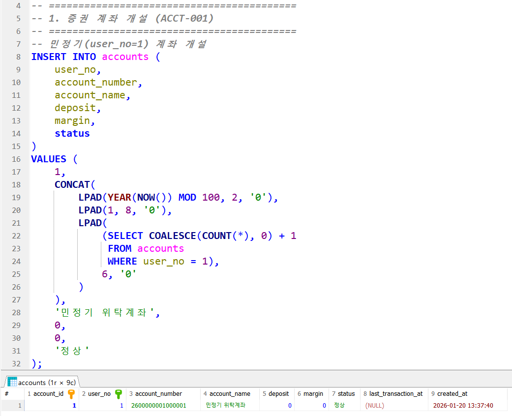
관심종목 조회
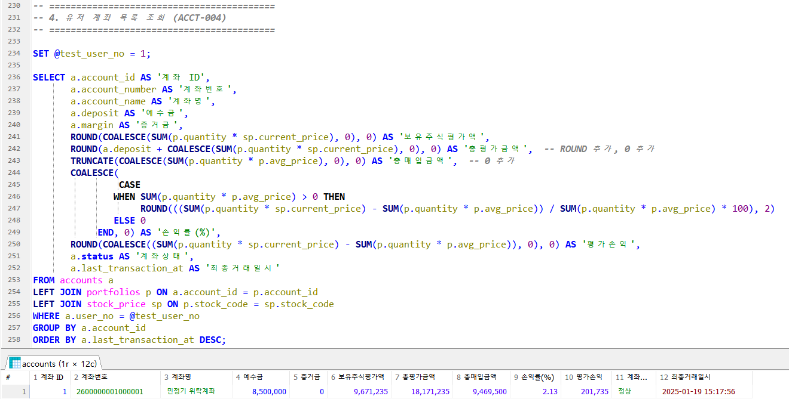
관리자 로그인
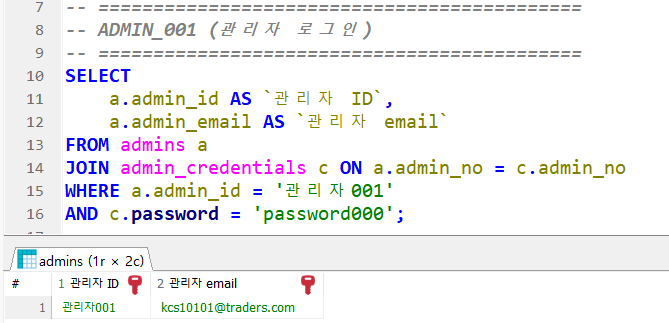
공지사항 및 알림
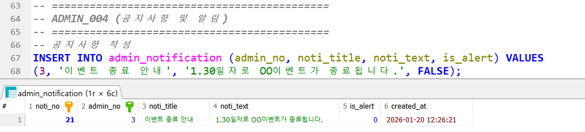
댓글작성 

좋아요 증가 및 삭제된 게시물 좋아요 확인
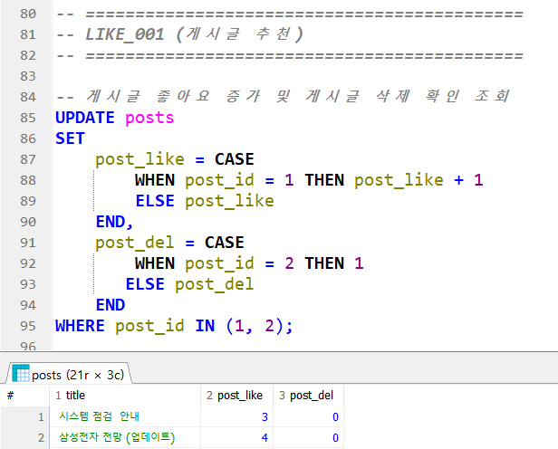
주식 거래 하기전 종목 검색
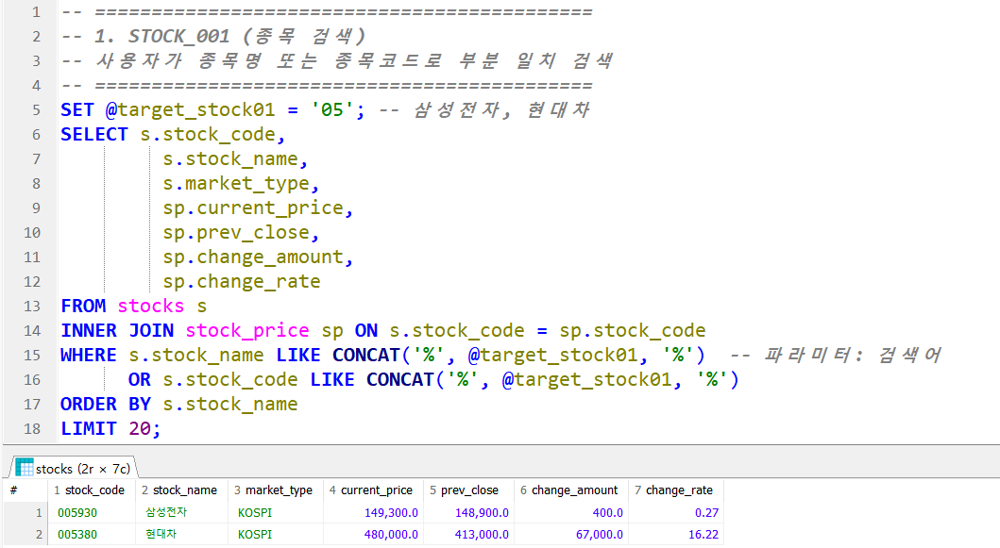
시나리오 매도 결과
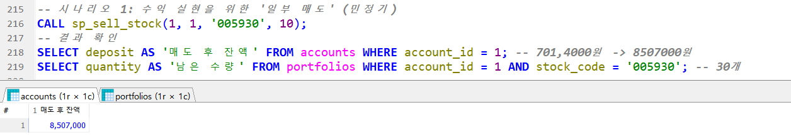	
회원 가입
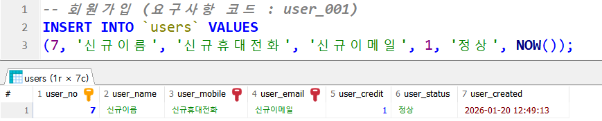
ID, 비밀번호 재 설정
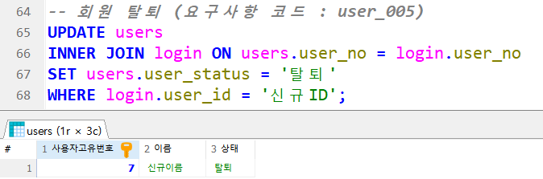
	
</div>
</details>

* * *

## 8. 🎉후기.

##### 민정기
팀장으로써 데이터베이스 구현을 처음으로 했는데 생각보다 팀원들이 잘 따라줘서 큰 막힘과 갈등없이 잘 끝난 프로젝트여서 다행입니다. 다들 하고싶은 주제 또는 구현하고 싶은 내용이 있었겠지만 그러한 욕구를 굽히고 제 이야기와 의견에 별 탈없이 받아들여서 다행이었습니다. 학부 이후로 한 프로젝트라서 생각보다 어렵고 다양한 한계를 받으면서 성장을 하게된 프로젝트였던것 같습니다. 더미 데이터를 이용하여 실제처럼 구현하는것 까지 하며, 데이터베이스의 전반적인 구조와 단계를 알게된 프로젝트였습니다.
* * *
##### 김예지
후기 작성
* * *
##### 방지혁
첫 팀 프로젝트를 통해 학부 과정에서 익힌 데이터베이스 정규화 이론을 실제 스키마 설계에 적용하며 다시 복습할 수 있었던 기회였습니다. 특히, 이번 프로젝트에서는 특히 단순 쿼리를 넘어 프로시져를 도입하는 값진 경험을 했습니다. 차후에는 백엔드와 프론트엔드까지 통합 구현하는 역량을 기르고 싶습니다.
* * *
##### 김정수
소프트웨어 공학을 처음 접해본 입장에서, 요구분석부터 데이터베이스 설계까지 직접 경험해 볼 수 있는 뜻깊은 시간이었습니다. 
프씬 많다는 것을 깨닫게 되었습니다. DML이라는 용어조차 낯설고 생소했지만, 기능 구현을 위해 직접 쿼리를 작성하고 실행하며 감을 익힐 수 있었습니다. 무엇보다 이 모든 과정이 처음이었던 저에게, 팀원들이 많은 도움이 주었습니다. 저의 고민과 어려움을 함께 공유하고 피드백을 주고받으며, 덕분에 데이터베이스 설계 목적과 필요성을 명확하게 이해할 수 있었습니다.
* * *
##### 이슬이
막연히 어렵다고만 느꼈던 데이터베이스를 실제로 설계해 보니 생각보다 신경 써야 할 요소가 많다는 것을 깨닫게 되었습니다. DML이라는 용어조차 낯설고 생소했지만, 기능 구현을 위해 직접 쿼리를 작성하고 실행하며 감을 익힐 수 있었습니다. 무엇보다 이 모든 과정이 처음이었던 저에게, 팀원들이 많은 도움이 주었습니다. 저의 고민과 어려움을 함께 공유하고 피드백을 주고받으며, 덕분에 데이터베이스 설계 목적과 필요성을 명확하게 이해할 수 있었습니다.
* * *
##### 현재진
이번 팀 프로젝트를 통해 처음으로 DB 설계를 진행해 보았는데 요구사항 명세서 작성 부터 테이블 명세서, ERD 설계까지 이어지는 체계적인 데이터베이스 설계 흐름을 경험했습니다.
실무애서 진행하는 방식처럼 하나의 서비스를 주제로 정하고 기획하여 DB 구현까지 할 수 있었다는 점이 많은 도움이 되었습니다.
직접 테이블도 만들어 보고 쿼리문도 작성 해보며 DB 설계와 SQL 활용에 대한 이해력을 높일 수 있었습니다.
* * *
